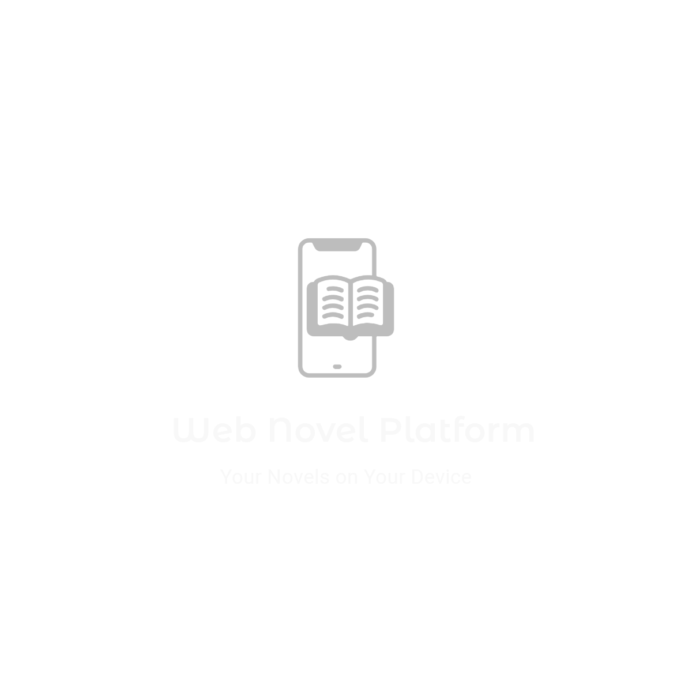

<!-- Improved compatibility of back to top link: See: https://github.com/othneildrew/Best-README-Template/pull/73 -->
<a name="readme-top"></a>
<!--
*** Thanks for checking out the Best-README-Template. If you have a suggestion
*** that would make this better, please fork the repo and create a pull request
*** or simply open an issue with the tag "enhancement".
*** Don't forget to give the project a star!
*** Thanks again! Now go create something AMAZING! :D
-->


<!-- PROJECT SHIELDS -->
<!--
*** I'm using markdown "reference style" links for readability.
*** Reference links are enclosed in brackets [ ] instead of parentheses ( ).
*** See the bottom of this document for the declaration of the reference variables
*** for contributors-url, forks-url, etc. This is an optional, concise syntax you may use.
*** https://www.markdownguide.org/basic-syntax/#reference-style-links
-->

[![MIT License][license-shield]][license-url]
[![LinkedIn][linkedin-shield]][linkedin-url]


<!-- PROJECT LOGO -->
<br />
<div align="center">
  <a href="https://github.com/LoreviQ/WebNovelPlatform">
    
  </a>


  <p align="center">
    <br />
    <a href="https://github.com/LoreviQ/WebNovelPlatform"><strong>Explore the docs »</strong></a>
    <br />
    <br />
    <a href="https://webnovelclient-y5hewbdc4a-nw.a.run.app/">View Demo</a>
    ·
    <a href="https://github.com/LoreviQ/WebNovelPlatform/issues/new?labels=bug&template=bug-report---.md">Report Bug</a>
    ·
    <a href="https://github.com/LoreviQ/WebNovelPlatform/issues/new?labels=enhancement&template=feature-request---.md">Request Feature</a>
  </p>
</div>


<!-- TABLE OF CONTENTS -->
<details>
  <summary>Table of Contents</summary>
  <ol>
    <li>
      <a href="#about-the-project">About The Project</a>
      <ul>
        <li><a href="#built-with">Built With</a></li>
      </ul>
    </li>
    <li>
      <a href="#getting-started">Getting Started</a>
      <ul>
        <li><a href="#prerequisites">Prerequisites</a></li>
        <li><a href="#installation">Installation</a></li>
      </ul>
    </li>
    <li><a href="#usage">Usage</a></li>
    <li><a href="#roadmap">Roadmap</a></li>
    <li><a href="#contributing">Contributing</a></li>
    <li><a href="#license">License</a></li>
    <li><a href="#contact">Contact</a></li>
  </ol>
</details>


<!-- ABOUT THE PROJECT -->
## About The Project

[demo.webm](https://github.com/user-attachments/assets/0e45e133-0978-4aa6-8c46-23925199c2f5)


<p align="right">(<a href="#readme-top">back to top</a>)</p>


### Built With

* [![GO][go.dev]][go-url]
* [![sqlite][sqlite.org]][sqlite-url]
* [![React][React.js]][React-url]
* [![Bootstrap][Bootstrap.com]][Bootstrap-url]

<p align="right">(<a href="#readme-top">back to top</a>)</p>


<!-- GETTING STARTED -->
## Getting Started

This is an example of how you may give instructions on setting up your project locally.
To get a local copy up and running follow these simple example steps.

The Project is divided into two parts, client and server(api). 

### Prerequisites

* Go: The server requires Go to be installed on your machine. To install Go, follow the instructions on the [official Go website](https://golang.org/doc/install).
* npm: The client requires npm, which can be updated tot he latest version with:
  ```sh
  npm install npm@latest -g
  ```

### Installation

1. Clone the repo
   ```sh
   git clone https://github.com/LoreviQ/WebNovelPlatform.git
   ```


2. Setup Server
  - Navigate to the server directory 
    ```sh
    cd ./api
    ```
  - Set up local environment. Create a .env with the following or set as environment variables:
    ```
    PORT="your port"
    DB_CONNECTION="libsql connection string - more info here: https://github.com/tursodatabase/libsql"
    JWT_SECRET="Secret key for authenticating JWT tokens"
    ```
  - Build and run the api
    ```sh
    go build -o webnovelapi && webnovelapi
    ```


3. Setup Client (in a seperate terminal)
  - Navigate to the client directory 
    ```sh
    cd ./client
    ```
  - Install NPM packages
    ```sh
    npm install
    ```
  - Set up local environment. Create a .env with the following or set as environment variables:
    ```
    API_URL="Your api url. Probably localhost:port. Will access a version of the API hosted on GCP by default"
    ```
  - Run the client:
    ```sh
    npm start
    ```
  
   

<p align="right">(<a href="#readme-top">back to top</a>)</p>


<!-- USAGE EXAMPLES -->
## Usage

A versatile web app designed for writers and readers alike. Built with a React front end and a Go back end, this application offers a seamless experience for managing and enjoying fiction and other text works. 

### Key Features

- **Chapter Uploads and Scheduled Releases**: Effortlessly upload chapters and schedule their release dates to keep your audience engaged and coming back for more.
- **User Accounts and Comments**: Create a vibrant community with support for user accounts and interactive comment sections.
- **User Tiers and Payments**: Monetize your content with tiered membership options and integrated payment processing.

### Expansion

The app's architecture allows for easy expansion. Consider adding functionalities such as:
- Writing contests
- Book clubs
- AI-driven recommendations for personalized reader experiences

### About

I built this for my personal use for distributing my own works, but it supports account systems so anyone can contribute. In addition, it acts as a robust template for developers looking to create similar web applications. Explore the codebase to see a practical implementation of scalable, user-friendly design.

<p align="right">(<a href="#readme-top">back to top</a>)</p>


<!-- ROADMAP -->
## Roadmap

- [ ] Chapters
    - [ ] Sheduling
- [ ] Comments
    - [ ] Upvotes
- [ ] Tiers
    - [ ] Tier based scheduling
    - [ ] Payment

<p align="right">(<a href="#readme-top">back to top</a>)</p>


<!-- CONTRIBUTING -->
## Contributing

Contributions are what make the open source community such an amazing place to learn, inspire, and create. Any contributions you make are **greatly appreciated**.

If you have a suggestion that would make this better, please fork the repo and create a pull request. You can also simply open an issue with the tag "enhancement".
Don't forget to give the project a star! Thanks again!

1. Fork the Project
2. Create your Feature Branch (`git checkout -b feature/AmazingFeature`)
3. Commit your Changes (`git commit -m 'Add some AmazingFeature'`)
4. Push to the Branch (`git push origin feature/AmazingFeature`)
5. Open a Pull Request

<p align="right">(<a href="#readme-top">back to top</a>)</p>


<!-- LICENSE -->
## License

Distributed under the MIT License. See `LICENSE.txt` for more information.

<p align="right">(<a href="#readme-top">back to top</a>)</p>


<!-- CONTACT -->
## Contact

Project Link: [https://github.com/LoreviQ/WebNovelPlatform](https://github.com/LoreviQ/WebNovelPlatform)

Email me at oliver.tj@protonmail.com

<p align="right">(<a href="#readme-top">back to top</a>)</p>


<!-- MARKDOWN LINKS & IMAGES -->
<!-- https://www.markdownguide.org/basic-syntax/#reference-style-links -->
[contributors-shield]: https://img.shields.io/github/contributors/LoreviQ/WebNovelPlatform.svg?style=for-the-badge
[contributors-url]: https://github.com/LoreviQ/WebNovelPlatform/graphs/contributors
[forks-shield]: https://img.shields.io/github/forks/LoreviQ/WebNovelPlatform.svg?style=for-the-badge
[forks-url]: https://github.com/LoreviQ/WebNovelPlatform/network/members
[stars-shield]: https://img.shields.io/github/stars/LoreviQ/WebNovelPlatform.svg?style=for-the-badge
[stars-url]: https://github.com/LoreviQ/WebNovelPlatform/stargazers
[issues-shield]: https://img.shields.io/github/issues/LoreviQ/WebNovelPlatform.svg?style=for-the-badge
[issues-url]: https://github.com/LoreviQ/WebNovelPlatform/issues
[license-shield]: https://img.shields.io/github/license/LoreviQ/WebNovelPlatform.svg?style=for-the-badge
[license-url]: https://github.com/LoreviQ/WebNovelPlatform/blob/master/LICENSE.txt
[linkedin-shield]: https://img.shields.io/badge/-LinkedIn-black.svg?style=for-the-badge&logo=linkedin&colorB=555
[linkedin-url]: https://www.linkedin.com/in/oliver-tj
[product-screenshot]: https://webnovelclient-y5hewbdc4a-nw.a.run.app/demo.webm
[Next.js]: https://img.shields.io/badge/next.js-000000?style=for-the-badge&logo=nextdotjs&logoColor=white
[Next-url]: https://nextjs.org/
[React.js]: https://img.shields.io/badge/React-20232A?style=for-the-badge&logo=react&logoColor=61DAFB
[React-url]: https://reactjs.org/
[Vue.js]: https://img.shields.io/badge/Vue.js-35495E?style=for-the-badge&logo=vuedotjs&logoColor=4FC08D
[Vue-url]: https://vuejs.org/
[Angular.io]: https://img.shields.io/badge/Angular-DD0031?style=for-the-badge&logo=angular&logoColor=white
[Angular-url]: https://angular.io/
[Svelte.dev]: https://img.shields.io/badge/Svelte-4A4A55?style=for-the-badge&logo=svelte&logoColor=FF3E00
[Svelte-url]: https://svelte.dev/
[Laravel.com]: https://img.shields.io/badge/Laravel-FF2D20?style=for-the-badge&logo=laravel&logoColor=white
[Laravel-url]: https://laravel.com
[Bootstrap.com]: https://img.shields.io/badge/Bootstrap-563D7C?style=for-the-badge&logo=bootstrap&logoColor=white
[Bootstrap-url]: https://getbootstrap.com
[JQuery.com]: https://img.shields.io/badge/jQuery-0769AD?style=for-the-badge&logo=jquery&logoColor=white
[JQuery-url]: https://jquery.com 
[go.dev]: https://img.shields.io/badge/Go-00ADD8?style=for-the-badge&logo=go&logoColor=white
[go-url]: https://go.dev/
[sqlite.org]: https://img.shields.io/badge/sqlite-003B57?style=for-the-badge&logo=sqlite&logoColor=white
[sqlite-url]: https://www.sqlite.org/
